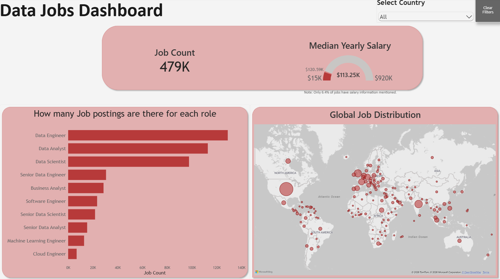
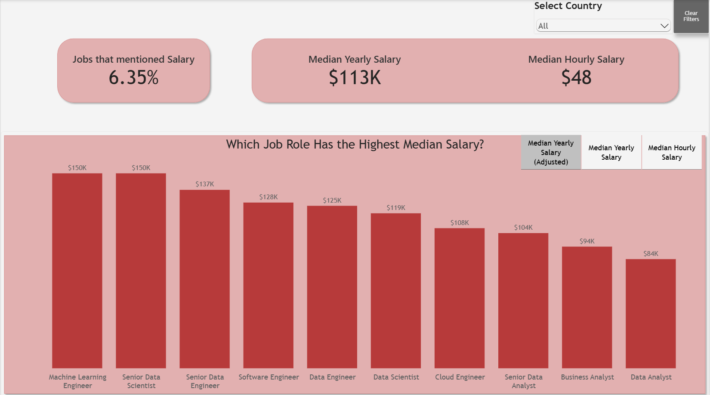
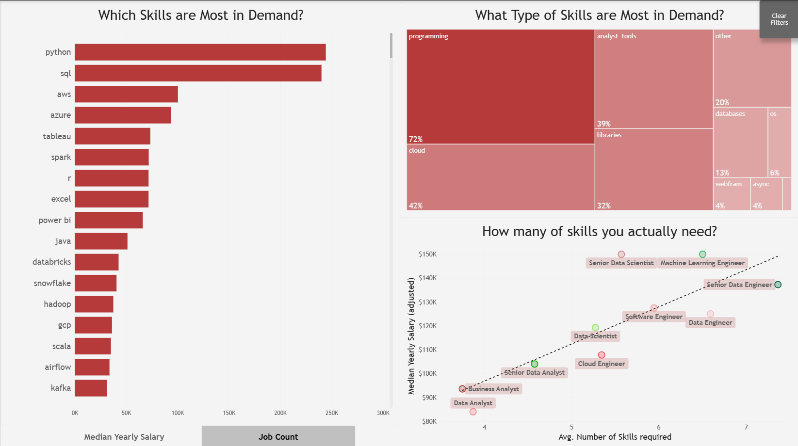
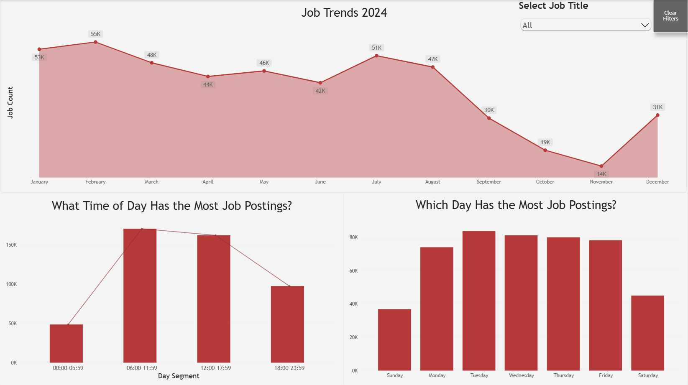
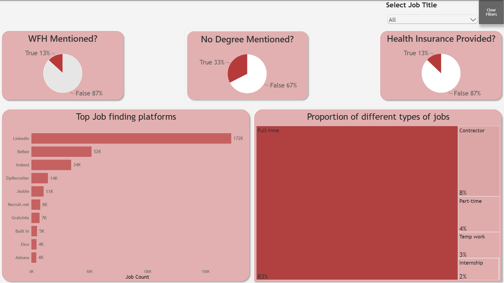
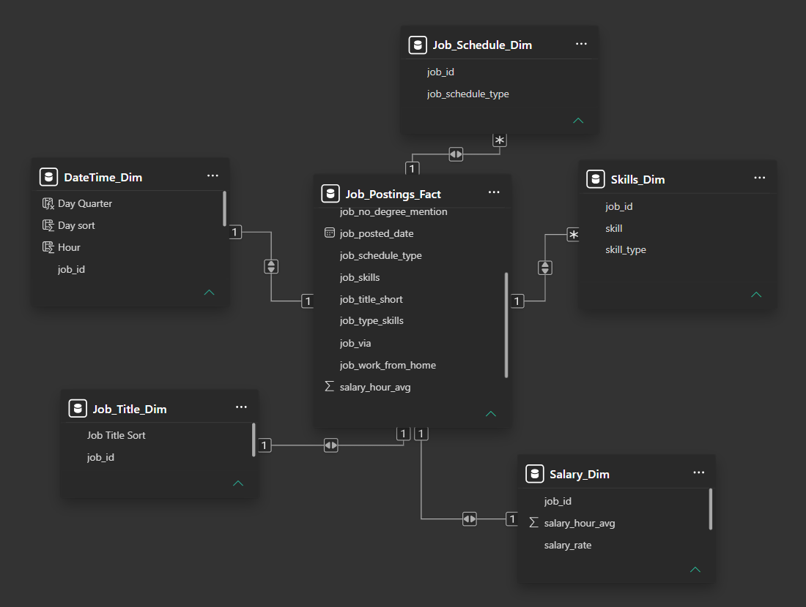

# Data Jobs Dashboard – 2024

An interactive **Power BI dashboard** analyzing data-related job postings from 2024. The dashboard explores job counts, salaries, required skills, job characteristics, hiring platforms, and the global distribution of job postings.

## Dashboard Overview

There are **5 pages** in the report:

- Job Market Overview
- Salary Analysis
- Job Trends
- Skills Analysis
- Job Characteristics

_This dashboard is designed for people who want a complete overview of the data job market, as well as those who want to explore the market themselves using filters and parameters._

### Job Market Overview

Shows job count, median yearly salary, and the distribution of job postings by country and job role.

- Filter job count, salary, and job postings by country (or job title using bar chart).
- Select a specific job role from the bar chart to explore its job distribution across countries.

### Salary Analysis

- Compare median salaries across different job roles.
- Filter the data by country.
- Although only a small portion of job postings include salary information, the available data still provides an indication of salary levels across different roles.

### Skills Analysis

This is personally my favourite page in the report and one of the most useful pages for people trying to land their first job in a data-related field.

- Identify which skills are most relevant based on:
  1. How many job postings require the skill.
  2. The median salary of jobs requiring the skill.
- Filter skills by skill type. For example, find the most relevant skills for programming or cloud-related roles.
- The scatter plot shows the relationship between the average number of skills required and median salary. In general, roles requiring more skills tend to have higher salaries, although this is not always the case.

### Job Trends

- Analyze monthly job posting trends throughout 2024.
- Analyze which days and times have the most job postings.
- Filter the trends by job title to explore patterns for a specific role.

### Job Characteristics Analysis

- Work-from-home (WFH) availability
- Degree requirements
- Health insurance availability
- Top job-finding platforms
- Filter job platforms based on job type. For example, identify the best platforms for finding full-time Data Analyst positions.

## Key Features

- Provides an overview of the data job market, including demand, salaries, required skills, job characteristics, and hiring patterns.
- Job role, country, salary, skills, and job platform analysis.
- Country and job-title filters.
- Interactive exploration of the job market based on different parameters.

## Questions Answered

The dashboard is designed to answer questions such as:

- Which data job roles have the highest demand?
- Which job roles have the highest median salaries?
- Which skills are most in demand?
- What types of skills are employers looking for?
- Does requiring more skills correspond to higher salaries?
- Which platforms contain the most job postings?
- How common are remote/WFH opportunities?
- How frequently are degree requirements mentioned in job postings?
- What types of employment arrangements are most common?
- Where are data-related jobs concentrated globally?
- When are most job postings published?

## Tools & Technologies

- **Power BI**  for dashboard development and visualization
- **DAX** for measures, calculated columns, salary adjustment, and analytical calculations
- **Power Query** for data preparation and transformation

## Limitations

- The data is from **2024**, so the findings may not accurately represent the current job market.
- Salary information is available for only a small portion of the job postings, so salary-related conclusions should be interpreted with caution.
- The dashboard is not published or hosted on the Power BI Service. To interact with the dashboard, download the `.pbix` file and open it using Power BI Desktop.

## Entity Relationship Diagram 

## Author

**Arun Negi**

Built as a Power BI data analytics project.